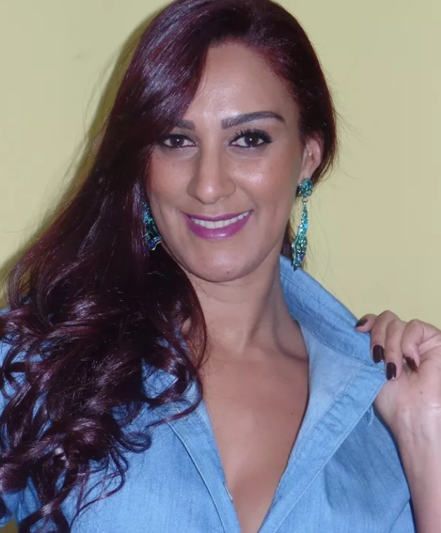

## <a name="especificacaoprojeto">Especificação do Projeto</a>

&nbsp;&nbsp; Foram definidos pela equipe os pontos mais relevantes a serem abordados neste projeto, deste modo, houve uma entrevista com voluntários para coletar informações sobre suas respectivas situações financeiras. Das informações coletadas, foram criadas personas e histórias de usuários, conforme abaixo descritas.  

## Personas 

**<h3 align="center" >João Alves de Almeida</h3 >**
 
  **Biografia**: João é um estudante universitário de 22 anos, vivendo em um alojamento estudantil.

**Metas**:
Economizar para a formatura, evitar dívidas estudantis excessivas.

**Motivação**:
Busca adquirir habilidades financeiras desde cedo, sonha em iniciar uma carreira sem dívidas.

**Frustrações**:
Dificuldade em equilibrar gastos com entretenimento e necessidades básicas.

**Bloqueadores**:
Falta de renda consistente, pressão social para gastar.
   
##

**<h3 align="center" >Ana Paula de Souza</h3 >**
 
  **Biografia**: Ana Paula é uma jovem profissional de 28 anos, recém-promovida em seu trabalho.

**Metas**:
Economizar para uma viagem ao exterior, começar a investir.

**Motivação**:
Alcançar independência financeira, aproveitar a vida agora e no futuro.

**Frustrações**:
Despesas inesperadas afetando seu orçamento, dificuldade em entender o mercado de investimentos.

**Bloqueadores**:
Falta de conhecimento em investimentos, instabilidade de renda.
   
##

**<h3 align="center" >Marcos Alencar</h3 >**
 
  **Biografia**: Marcos é um pai solteiro de 35 anos, com dois filhos adolescentes.

**Metas**:
Economizar para a educação dos filhos, criar um fundo de aposentadoria.

**Motivação**:
Proporcionar o melhor para seus filhos, assegurar um futuro confortável.

**Frustrações**:
Despesas imprevistas com educação e saúde, dificuldade em equilibrar trabalho e vida familiar.

**Bloqueadores**:
 Falta de tempo para buscar oportunidades de renda extra, falta de suporte familiar.
   
 ##

 **<h3 align="center" >Carla Moreira</h3 >**
 
  **Biografia**: Carla, 40 anos, decidiu iniciar seu próprio negócio no setor de alimentos.

**Metas**:
Fazer crescer o negócio, gerenciar dívidas relacionadas ao empreendimento.

**Motivação**:
Realizar seu sonho empreendedor, alcançar estabilidade financeira por meio do negócio.

**Frustrações**:
Incertezas financeiras no início do negócio, dificuldade em equilibrar investimento pessoal e comercial.

**Bloqueadores**:
Desafios de fluxo de caixa, despesas iniciais elevadas.
   
 ##

 **<h3 align="center" >Sofia de Azevedo</h3 >**
 
  **Biografia**: Sofia, 55 anos, está prestes a se aposentar após uma carreira de sucesso.

**Metas**:
Garantir um fluxo de renda sustentável na aposentadoria, viajar e aproveitar a vida.

**Motivação**:
Desfrutar da aposentadoria sem se preocupar com finanças, explorar novas paixões.

**Frustrações**:
Incertezas sobre quanto dinheiro é suficiente para a aposentadoria, preocupações com despesas médicas.

**Bloqueadores**:
Falta de conhecimento em como criar uma estratégia de retirada de fundos, resistência a adotar tecnologias financeiras.
   
	
## Histórias de Usuários

Com base na análise das personas forma identificadas as seguintes histórias de usuários:

|EU COMO... `PERSONA`| QUERO/PRECISO ... `FUNCIONALIDADE` |PARA ... `MOTIVO/VALOR`                 |
|--------------------|------------------------------------|----------------------------------------|
|João Alves  | Economizar para a formatura        | Iniciar uma carreira sem dívidas       |
|João Alves  | Adquirir habilidade financeira        | Equilibrar gastos       |
|Ana Paula de Souza       | Começar a investir  | Alcançar independência financeira e aproveitar a vida agora e no futuro |
|Ana Paula de Souza       | Evitar despesas inesperadas  | Viajar para o exterior |
|Marcos Alencar  | Economizar para a educação dos filhos           | Proporcionar o melhor para os filhos e assegurando um futuro confortável               |
|Marcos Alencar  | Buscar renda extra           | Criar fundo de aposentadoria               |
|Carla Moreira       | Gerenciar dívidas relacionadas ao empreendimento | Alcançar estabilidade financeira por meio do negócio |
|Carla Moreira       | Equilibrar investimento pessoal e profissional |Fazer crescer seu do negócio |
|Sofia de Azevedo  | Garantir um fluxo de renda sustentável na aposentadoria  | Desfrutar da aposentadoria sem se preocupar com finanças e viajar e aproveitar a vida |
|Sofia de Azevedo  | Adotar tecnologias financeiras  | Criar uma estratégia de retirada de fundos |

## Requisitos

As tabelas que se seguem apresentam os requisitos funcionais e não funcionais que detalham o escopo do projeto.

### Requisitos Funcionais

|ID    | Descrição do Requisito  | Prioridade |
|------|-----------------------------------------|----|
|RF-001| Registro de Usuário: Permitir que os usuários criem contas pessoais com informações básicas, como nome, e-mail e senha, para acessar recursos personalizados. | ALTA | 
|RF-002| Navegação Intuitiva: Garantir que a navegação pelo site seja fácil e intuitiva, com menus claros e categorias bem organizadas para os diferentes tópicos de finanças.   | ALTA |
|RF-003| Conteúdo Educacional: Oferecer uma variedade de artigos, tutoriais e guias que abordem conceitos financeiros, estratégias de poupança, investimentos e planejamento futuro.   | MÉDIA |
|RF-004| Contato e Suporte: Fornecer um canal de contato para os usuários enviarem perguntas, dúvidas ou comentários, com prazo de resposta adequado.   | ALTA |
|RF-005| Estudos de Caso Inspiradores: Apresentar estudos de caso reais de pessoas que alcançaram sucesso financeiro, para ilustrar como os conceitos aprendidos podem ser aplicados na vida real.   | MÉDIA |
|RF-006| Ferramentas de Acompanhamento Financeiro: Oferecer funcionalidades para os usuários acompanharem suas despesas, estabelecerem metas de economia e monitorarem seu progresso.   | ALTA |
|RF-007| Links para Recursos Externos: Incluir links confiáveis para outros sites, ferramentas e recursos relacionados à educação financeira para ampliar o conhecimento dos usuários.   | MÉDIA |
|RF-008| Notificações e Newsletter: Oferecer opção para os usuários se inscreverem em notificações, atualizações por e-mail ou newsletters periódicas para se manterem informados.   | MÉDIA |
|RF-009|Seção de Investimentos: Oferecer informações sobre diferentes tipos de investimentos, riscos e oportunidades de crescimento financeiro. | BAIXA |
|RF-010|Avaliação de Conhecimento: Apresentar questionários ou testes para que os usuários possam avaliar seu conhecimento em educação financeira e identificar áreas para melhorar.| BAIXA |

### Requisitos não Funcionais

|ID     | Descrição do Requisito  |Prioridade |
|-------|-------------------------|----|
|RNF-001| O site deve ser intuitivo e de fácil utilização, com um design responsivo que se adapte a diferentes dispositivos, como desktops, tablets e smartphones. | ALTA | 
|RNF-002| O sistema deve ser seguro e proteger as informações financeiras do usuário. |  ALTA | 
|RNF-003| O site deve ser compatível com os principais navegadores do mercado (Google Chrome, Firefox, Microsoft Edge). |  ALTA |
|RNF-004| O sistema deve ser fácil de usar e ter uma interface amigável para o usuário final. |  BAIXA |
|RNF-005| O site deve carregar rapidamente e oferecer uma experiência sem atrasos, garantindo que os usuários possam acessar o conteúdo sem problemas. |  MÉDIA-ALTA |
|RNF-006| Garantir a segurança dos dados dos usuários, implementando criptografia de dados, autenticação segura e proteção contra ataques cibernéticos. |  ALTA |
|RNF-007| Assegurar que o site esteja em conformidade com regulamentações de privacidade, direitos autorais e outras leis aplicáveis. |  ALTA |
|RNF-008| Implementar rotinas regulares de backup dos dados do site e ter um plano de recuperação de dados em caso de falhas. |  ALTA |
|RNF-009| Garantir que o conteúdo do site siga padrões de qualidade, precisão e confiabilidade, oferecendo informações confiáveis e atualizadas. |  ALTA |

## Restrições

O projeto está restrito pelos itens apresentados na tabela a seguir.

|ID| Restrição                                             |
|--|-------------------------------------------------------|
|01| O projeto deverá ser entregue no final do semestre letivo, data limite: 06/12/2023 |
|02| Não pode ser desenvolvido sem um módulo de backend        |
|03| A equipe não pode subcontratar o desenvolvimento do trabalho, devendo ser desenvolvido apenas pelo grupo de alunos        |
|04| O projeto deve ser publicado no GitHub em seu devido repositório        |
|05| As tecnologias utilizadas neste projeto devem ser: C#, .Net,Banco de dados SQL,Visual Studio Code      |

## Diagrama de Casos de Uso

