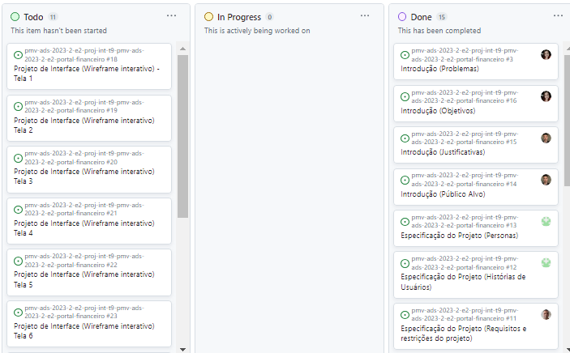

# Metodologia

Apresentamos a seguir a metodologia adotada pelo grupo para desenvolvedor o sistema de controle financeiro. Destacamos também as ferramentas e ambientes de trabalho utilizados pela equipe para o desenvolvimento do projeto. Isso inclui a descrição dos diferentes ambientes utilizados, bem como a estrutura para gerenciamento do código-fonte. Além disso, abordamos o processo e as ferramentas utilizadas para organizar e gerenciar o time.

 

## Relação de Ambientes de Trabalho

Os artefatos do projeto são desenvolvidos a partir de diversas plataformas e a relação dos ambientes com seu respectivo propósito é apresentada na tabela que se segue:

|Ambiente    | Plataforma  | Link de Acesso |
|-----------|---------------------|-------------------|
|Repositório de código fonte| GitHub |https://github.com/ICEI-PUC-Minas-PMV-ADS/pmv-ads-2023-2-e2-proj-int-t9-pmv-ads-2023-2-e2-portal-financeiro/blob/main/src/README.md | 
|Documentos do Projeto| GitHub | https://github.com/ICEI-PUC-Minas-PMV-ADS/pmv-ads-2023-2-e2-proj-int-t9-pmv-ads-2023-2-e2-portal-financeiro/tree/main/docs |
|Projeto de Interface e Wireframes| Figma | https://www.figma.com |
|Gerenciamento de Projeto| GitHub | https://github.com/ICEI-PUC-Minas-PMV-ADS/IntApplicationProject-Template |
|Comunicação entre Stakeholders | WhatsApp e Teams |  https://teams.microsoft.com - https://www.whatsapp.com/?lang=pt_BR  |
|Editor de código | Visual Studio Code| https://vscode.dev/ |
 

## Gerenciamento de Projeto

A equipe utiliza metodologias ágeis, tendo escolhido o Scrum como base para definição do processo de desenvolvimento.
A equipe está organizada da seguinte forma:

**Scrum Master:**  Luiz Nader Arruda Junior

**Product Owner:** Lorena Poliane de Oliveira

**Equipe de Desenvolvimento:** 
- Gustavo Henrique Pereira da Silva
- Lorena Poliane de Oliveira
- Luiz Nader Arruda Junior
- Mário José Copertino Filho
- Paulo Isidoro de Oliveira
- Victor Gabriel Barbosa de Araújo

**Equipe de Design:**
- Gustavo Henrique Pereira da Silva
- Lorena Poliane de Oliveira
- Luiz Nader Arruda Junior
- Mário José Copertino Filho
- Paulo Isidoro de Oliveira
- Victor Gabriel Barbosa de Araújo

A plataforma Github Project está sendo utilizada pela equipe para organização e distribuição das tarefas do projeto, sendo as atividades segmentadas pelas listas a seguir: 
 
* **Product Backlog**: contém a lista de todas as macros tarefas previstas para a entrega de todo o projeto e, a cada sprint, serão elencadas para a lista “To do” conforme prioridades. Se necessário, podem ser descontinuadas. 

* **To Do**: a lista apresenta todas as tarefas elencadas para serem trabalhadas durante a sprint. 

* **In Progress**: apresenta as tarefas que já foram iniciadas pelos responsáveis atribuídos. 

* **Done**: assim que a tarefa é finalizada ela é apresentada nesta lista. Significa que não haverá mais a necessidade de atuação. 

O quadro kanban do GitHub Project utilizado pela equipe está disponível através da URL https://github.com/ICEI-PUC-Minas-PMV-ADS/pmv-ads-2023-2-e2-proj-int-t9-pmv-ads-2023-2-e2-portal-financeiro e atualmente, se encontra neste estado, conforme Figura Kanban.  

Tela do kanban utilizada pela equipe 
 

