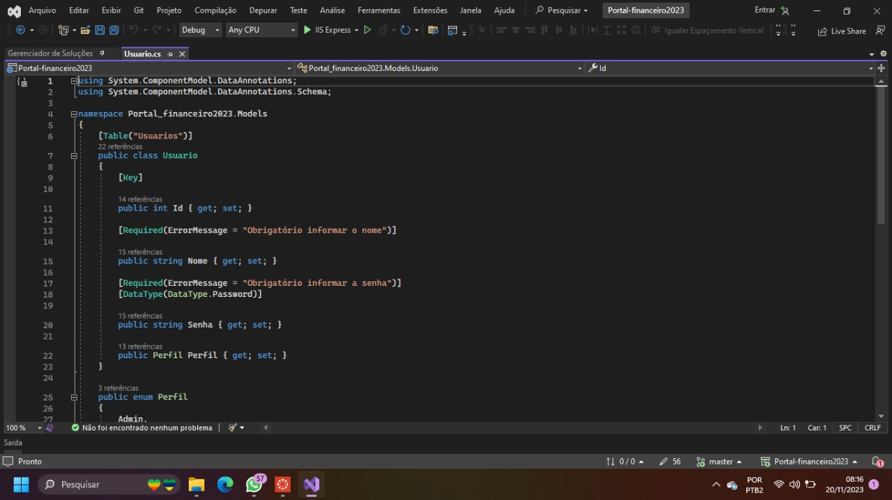
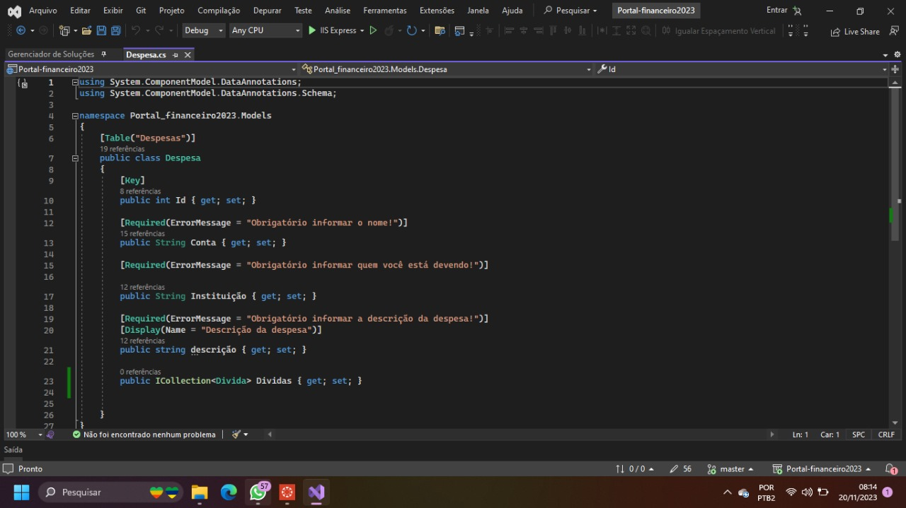

# Registro de Testes de Software

Foram realizados os testes de acordo com as tabelas mostradas no ítem 08 (Plano de Testes de Software), testes de funcionalidades e de controle de acesso, podendo ser resumidos na tabela abaixo:

| Código do Teste | Descrição | Status | Dispositivo |
|---------------------|-----------------------|-------------|-------------|
| CT-01 | Cadastrar perfil | ✅ Passou | Chrome |
| CT-02 | Efetuar login | ✅ Passou | Chrome |
| CT-03 | Cadastrar Despesa | ✅ Passou | Chrome |
| CT-04 | Visualizar Lista de Despesas | ✅ Passou | Chrome |

### CT - 01: Cadastrar perfil

#### Descrição do Teste:
1. Acessar o navegador.
2. Informar o endereço do site URL: [http://localhost:44328].
3. Clicar em "Cadastre-se".
4. Preencher os campos obrigatórios (nome, e-mail, senha, data de nascimento).
5. Clicar em "Cadastrar".

#### Evidência:

#### Estrutura de Dados:
 

#### Resultado de Êxito:
Foi possível informar os dados corretamente.
#### Resultado de Não Êxito:
Não foi possível informar os dados corretamente.

### CT - 02: Efetuar login

#### Descrição do Teste:
1. Acessar o navegador.
2. Informar o endereço do site URL: [http://localhost:44328]).
3. Clicar no botão "Login".
4. Preencher o campo nome.
5. Preencher o campo da senha.
6. Clicar em "Acessar".

#### Evidência:

#### Estrutura de Dados:
 
 
#### Resultado de Êxito:
Os dados inseridos são aceitos para fazer o login com sucesso.
#### Resultado de Não Êxito:
Os dados inseridos não são aceitos para realizar login.

### CT - 03: Cadastrar Despesa

#### Descrição do Teste:
1. Realizar login na aplicação conforme CT-02.
2. Navegar até a seção de cadastro de despesas.
3. Clicar em "Adicionar Despesa".
4. Preencher os campos obrigatórios (conta, instituição, descrição).
5. Clicar em "Adicionar".

#### Evidência:

#### Estrutura de Dados:
 

#### Resultado de Êxito:
A tabela aceita e demonstra corretamente os valores fornecidos nos campos;
#### Resultado de Não Êxito:
Não foi possível aceitar os valores fornecidos na tabela.

### CT - 04: Visualizar Lista de Despesas

#### Descrição do Teste:
1. Realizar login na aplicação conforme CT-02.
2. Navegar até a seção de Lista de despesas.

#### Evidência:

#### Estrutura de Dados:
 
 
#### Resultado de Êxito:
A tabela cumpre o papel proposto de dar resultado das despesas;
A tabela mostra a mensagem correta de acordo com a porcentagem das despesas pré-definidas;
#### Resultado de Não Êxito:
A tabela não cumpre o papel proposto de dar resultado das despesas;
A tabela mostra uma mensagem de erro ao calcular a porcentagem das despesas pré-definidas;

